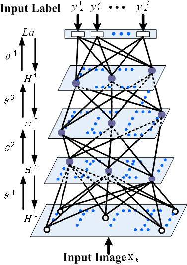

<strong>Simultaneous unsupervised and supervised learning   of cognitive functions in biologically plausible   spiking neural networks</strong>

<small>Trevor Bekolay, Carter Kolbeck, Chris Eliasmith  
*Centre for Theoretical Neuroscience, University of Waterloo*  
[bekolay.org/cogsci2013-pres](http://bekolay.org/cogsci2013-pres)</small>

Spaun: transmission & binding

## Can the connections in Spaun be the result of biologically plausible learning?

## 1. Cognitive functions

### Represent symbols with vectors

 $\Rightarrow \left[0.42, 0.12, 0.35, ...\right]$

## Why?

 $\Rightarrow \left[0.42, 0.12, 0.35, ...\right]$

 $\Rightarrow \left[0.38, 0.14, 0.30, ...\right]$

 $\Rightarrow \left[0.42, 0.12, 0.35, ...\right]$

 $\Rightarrow \left[0.12, 0.75, 0.25, ...\right]$

## Transmission

$f(X) = X$

## Binding

$$f(X, Y) = Z$$

\begin{aligned}
  f(Z, X') &\approx Y \\\\
  f(Z, Y') &\approx X
\end{aligned}

## 2. In spiking neurons

### Encode vectors in neural populations

$\left[0.42, 0.12, 0.35, ...\right] \Rightarrow$ 

$a_i = f(\color{red}{e_i} \cdot X)$

### Decode vectors from neural populations

 $\Rightarrow \left[0.41, 0.12, 0.36, ...\right]$

$$\hat{X} = \sum_i \color{red}{d_i} a_i$$

## 3. Supervised and unsupervised learning

## Supervised learning

Given error $E$,

\begin{aligned}
  \Delta d\_i &\propto E a\_i \\\\
  \Delta \omega\_{ij} &\propto  e\_j \cdot E a\_i
\end{aligned}

Classifying digits: 96.31% accuracy (Spaun: 94% accuracy)

## Unsupervised learning

$$\Delta \omega_{ij} \propto a_i a_j (a_j - \theta)$$

## Machine learning

## Combined learning

$$\Delta \omega_{ij} \propto a_i \left[\color{red}{S} e_j \cdot E + \color{red}{(1 - S)} a_j (a_j - \theta)\right]$$

Classifying digits: 98.47% accuracy (Supervised: 96.31%)

## Learning parameters

* $N / d$: neurons per dimension
* $\kappa$: learning rate
* $S$: supervision ratio

<iframe width="800" height="280" src="//jaberg.github.io/hyperopt/" frameborder="0"></iframe>

[ jaberg/hyperopt](https://github.com/jaberg/hyperopt)

## 1. Parameter-less learning

<h2 class="fragment">2. Generating error signals ($E$)</h2>

Thanks to Carter Kolbeck, Chris Eliasmith,  
James Bergstra, and NSERC.

----

<small>Simultaneous unsupervised and supervised learning of cognitive functions  in biologically plausible spiking neural networks</small>

[ Paper & code](https://github.com/tbekolay/cogsci2013)
| [bekolay.org/cogsci2013-pres](http://bekolay.org/cogsci2013-pres)
| [ Source](https://github.com/tbekolay/cogsci2013-pres)
